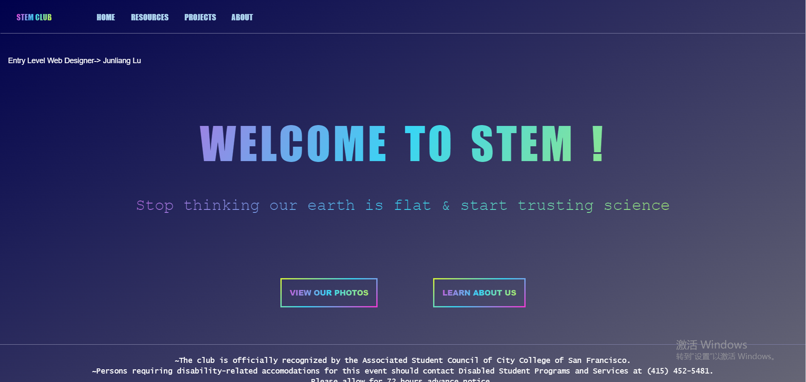

# stemClub
A college club website to promote science.
> URL: https://stemclubccsf.snapluu.org/

### Preview

### Motivation
Web page design: I will learn HTML and CSS these two markup languages, with some basics of JavaScript programming language, to create a project, which involves designing a website with dynamic elements for my CCSF STEM club.  It is essential for me because I decided to write my codes to develop my first web page instead of using Google Site, and it will help improve my programming skills.

### Why this project
Many websites that are designed by designer and do not need to write code are not cool enough to attract more viewers.  Just like making a CCSF club website, the website design will be common and boring if only using Google sites.  Therefore, I decided to write my code to create a club website for my CCSF STEM Club to attract more students to join the club.  The project not only helps me get familiar with programming application but also help advertise my organization.

### Description
- Built mock designs and wireframes for landing pages of a college club website to promote science
- Imported Bootstrap components to create animated elements and hover effects on texts and images
- Applied CSS styles such as gradient colors on texts to optimize the user experience

### Skills to learn
- HTML
- CSS
- Bootstrap
- JavaScript
- Front End Development
- Git
- Web Development
- Web Hosting
